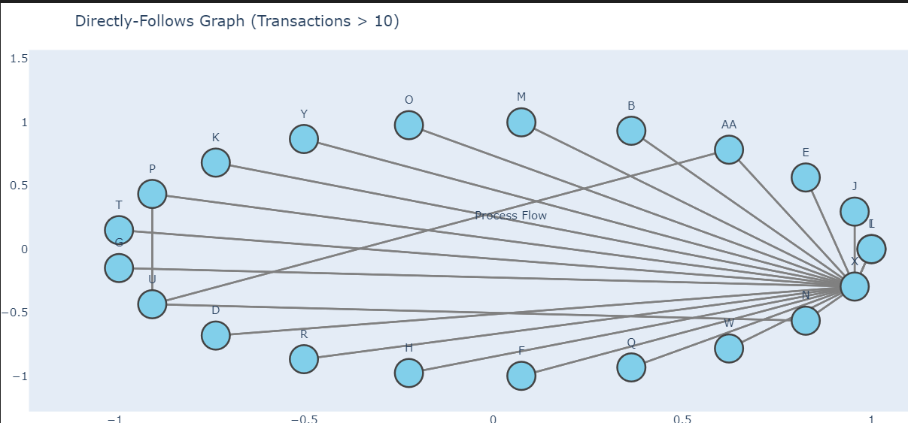
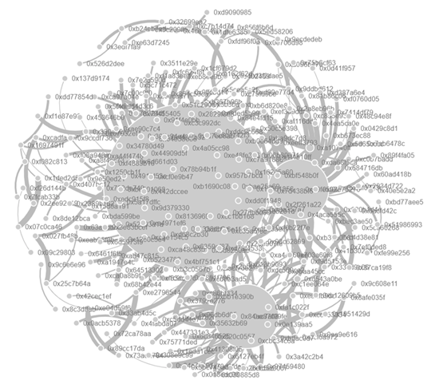

# 🕵️‍♂️ Suspicious Activity Detection Using Blockchain Process Mining


This repository contains the data, analysis code, and visualization assets used in the research project **"Suspicious Activity Detection Using Blockchain Process Mining"**, a case study based on the **CryptoKitties** decentralized application (DApp) on the Ethereum blockchain.

## 📜 Abstract

This project explores how **process mining** and **data analytics** can be combined to audit blockchain applications for suspicious activity. Using real transaction data from **CryptoKitties**, we identify patterns of behavior that suggest potential unethical or market-manipulating practices, such as:

- **Black-market trading**
- **Pump-and-dump schemes**
- **Asset cloning or duplication**

Through the use of tools like **PM4Py**, **social network analysis**, and **XES-formatted blockchain event logs**, this project demonstrates how modern data science techniques can be applied to blockchain environments for transparency and auditability.

---

## 📁 Project Structure

```plaintext
Public Github/
├── assets/
│
├── Data/
│   └── CryptoKitties.xes         # Ethereum blockchain transaction logs in XES format from ingo-weber website also can be extracted using the ethql
│
├── Results Sample/ # Shorten file results
│
└── CrypyoKittiesPM4PyV2.ipynb    # Main analysis notebook
```

---

## 📊 Visualizations

Below are some key visuals generated during the analysis:

### Process Model of Genetic Clones


> Process tree model for CryptoKitties that share identical genes with the original "LilBub".

---

### Suspicious Trading Network


> Network graph showing frequent transactions among a small number of wallets for "Dioscuri Balinese", suggesting potential collusion.

---

### Some Key Dataset Stats

- 🧬 Unique Kitties: `1,997,605`
- 📄 Total Events: `18,059,296`
- 🔁 Activity Types: `12`
- 📆 Period: `2017-11-23` to `2021-04-15`

---

## 🚀 How to Run

1. Clone the repository
2. Install the Python dependencies:
```bash
pip install -r requirements.txt
```
3. Launch the Jupyter notebook:

> 💡 The main analysis uses the [`pm4py`](https://pm4py.fit.fraunhofer.de/) process mining library and standard data science packages like pandas and matplotlib.

---

## 🧠 Some Key Findings

- **Duplicate genes**: Over 3,700 kitties had genetically identical copies — possibly violating implied scarcity rules.
- **Off-market trades**: Some kitties, like "Dioscuri Balinese", were traded hundreds of times in non-transparent settings, often at inflated prices.
- **High-frequency transactions**: Kitties with extremely high trade counts (e.g., 1,684 transfers) suggest non-economic behavior.

---

## 🧪 Tools & Libraries

- `PM4Py`: Process mining
- `pandas`, `matplotlib`, `networkx`: Data analysis and visualization
- `XES`: Event log standard for process mining

---

## 📚 Citation

If you use this project or dataset, please cite:

> Manzor, F., Burke, A., Venkatachalam, N., & Janusz, A. (2025). *Suspicious Activity Detection Using Blockchain Process Mining*. Queensland University of Technology.

---

## 📬 Contact

For questions or collaboration opportunities, reach out to:

- Felipe Manzor: [fmanzor@fen.uchile.cl](mailto:fmanzor@fen.uchile.cl)
- Adam Burke, Nagarajan Venkatachalam, Andrzej Janusz: {at.burke, venkat.venkatachalam, andrzej.janusz}@qut.edu.au


## 📬 Special acknowledgements

https://ingo-weber.github.io/dapp-data/ We use tha data consolidated here to perform the complience analyis the rest of acknolowments can be found in the full papper 